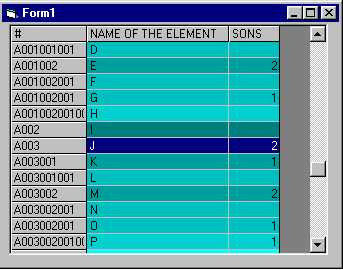



## Grid Hierarcical

### Description

Source code of a Control, subclassing the MSFlexGrid, to create a Hierarcical Grid (like Treeview). But, as in a MSFlexGrid, you can set individual fonts, colors, even pictures on any cell.
 
### More Info
 

             |
---                |---
**Submitted On**   |2000-04-19 17:55:42
**By**             |[Grenville Tryon](https://github.com/Planet-Source-Code/PSCIndex/blob/master/ByAuthor/grenville-tryon.md)
**Level**          |Intermediate
**User Rating**    |5.0 (20 globes from 4 users)
**Compatibility**  |VB 5\.0, VB 6\.0
**Category**       |[Custom Controls/ Forms/  Menus](https://github.com/Planet-Source-Code/PSCIndex/blob/master/ByCategory/custom-controls-forms-menus__1-4.md)
**World**          |[Visual Basic](https://github.com/Planet-Source-Code/PSCIndex/blob/master/ByWorld/visual-basic.md)
**Archive File**   |[CODE\_UPLOAD49694192000\.zip](https://github.com/Planet-Source-Code/grenville-tryon-grid-hierarcical__1-7394/archive/master.zip)

